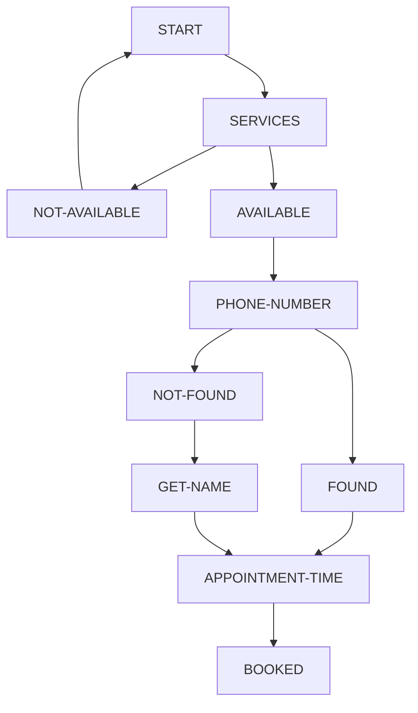
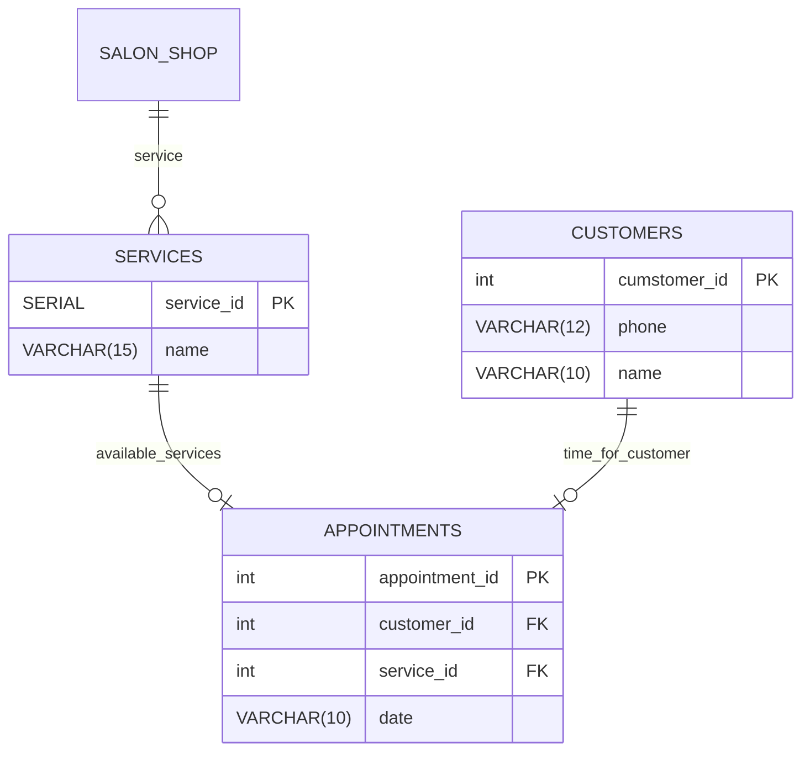

Here is a simple flow chart:

```mermaid
graph TD;
    START-->SERVICES;
    SERVICES-->NOT-AVAILABLE;
    NOT-AVAILABLE-->START;
    SERVICES-->AVAILABLE;
    AVAILABLE-->PHONE-NUMBER;
    PHONE-NUMBER-->FOUND;
    FOUND-->APPOINTMENT-TIME
    PHONE-NUMBER-->NOT-FOUND;
    NOT-FOUND-->GET-NAME;
    GET-NAME-->APPOINTMENT-TIME;
    APPOINTMENT-TIME-->BOOKED
```

Here is a ER Diagram:

```mermaid
erDiagram
    SERVICES ||--o| APPOINTMENTS: available_services
    SERVICES {
        SERIAL service_id PK
        VARCHAR(15) name
    }
    
    CUSTOMERS ||--o| APPOINTMENTS: time_for_customer
    CUSTOMERS {
        int cumstomer_id PK
        VARCHAR(12) phone
        VARCHAR(10) name
    }
 APPOINTMENTS{
        int appointment_id PK
        int customer_id FK
        int service_id FK
        VARCHAR(10) date
    }
    SALON_SHOP only one to zero or more SERVICES: service
```
